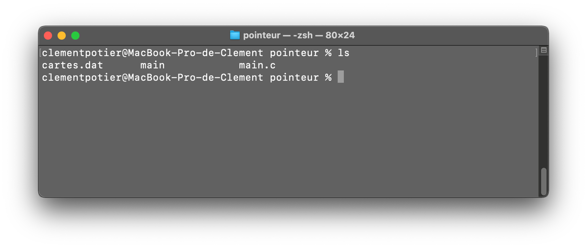

## Voyager entre les dossiers en ligne de commande 

import TOCInline from '@theme/TOCInline';


<TOCInline toc={toc}/>
<br/>

### 1. <u>Ouvrir le terminal via spotlight :mag_right:</u> 

&emsp;L'équivalent d'un invite de commande sur MacOs est le **Terminal**. 
Celui-ci peut s'ouvrir de plusieurs manières telles que : 
<ul>
    <li>Depuis le lauchpad</li>
    <li>Depuis spotlight</li>
</ul>
Je vais m'éterniser sur cette dernière méthode et utiliser Spotlight.
<br/>
<br/>


```
 > cmd + espace 
 > Puis tapez : "terminal"
```

:::tip spotlight
Spotlight est un outil très puissant mais sous-couté. C'est une barre de recherche qui peut **TOUT** trouver.<br/>
Il peut chercher un fichier quelconque, un logiciel ou encore même résoudre un calcul.
:::


### 2. <u>Afficher les sous dossiers et fichiers de notre répertoire</u>  
&emsp; Se ballader en ligne de commande n'a rien d'intuitif pour le commun des mortels. 
C'est pourquoi, en l'absence de détails visuels, il est toujours pratique de savoir afficher les fichiers/dossiers présents à l'endroit où nous nous trouvons.
```
 ls
```


### 3. <u>Rentrer dans un dossier :file_folder:</u>
```
cd + <nom_de_votre_dossier>
```
**Exemple :** cd Downloads

<br/>

### 4. <u>Revenir en arrière dans les dossiers</u>
&emsp; Naviguer dans les dossiers signifie souvent devoir revenir en arrière pour diverses raisons. 
Que ce soit car on ne trouve pas ce qu'on cherche, car on s'est trompé, ou que sais-je, voici comment **revenir sur vos pas** : 
```
cd -
```
<br/>

### 5. <u>Changer de disque :floppy_disk:</u>
&emsp; Il peut s'avérer utile de savoir changer de disque lorsqu'on travaille sur un disque dur externe. 
La commande est moins intuitive que sur Windows, la voici : 
```
> cd /volumes
> cd <nom_de_votre_disque>
```
